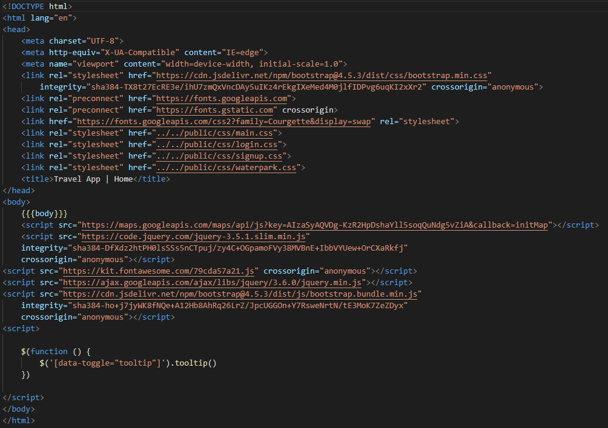
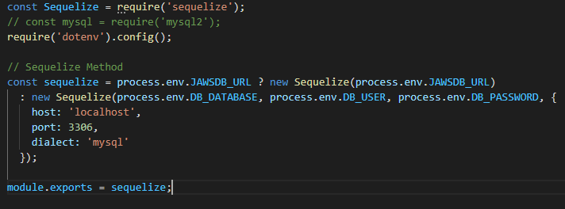
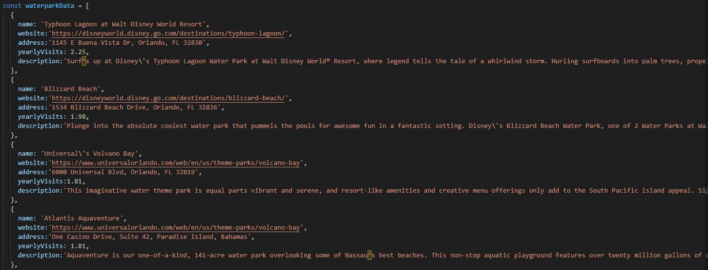
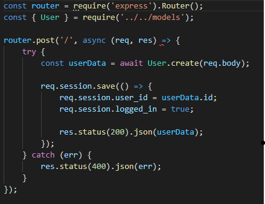
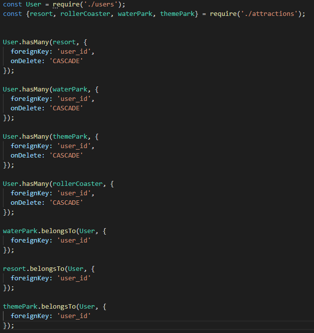
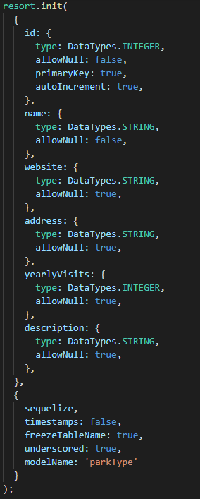

# Project-2-Travel-App

## USER STORY

    AS A team of web developers
    WE WANT to create a REST API that acts as a travel planning website allowing users to view and save some of the top resorts, theme parks, water parks, and roller coasters
    SO THAT their personal profile page can be updated with some of the various locations they would like to visit in the future.

## TABLE OF CONTENTS

- [DESCRIPTION](#description)
- [INSTALLATION](#installation)
- [FUTUREDEVELOPMENTS](#futuredevelopments)
- [LICENSE](#license)
- [QUESTIONS](#questions)

## DESCRIPTION
Our travel application is designed to present users with four different options for travel destinations like theme parks, water parks, resorts, and specialty rollercoasters. Each subsequent page displays the top five destinations/parks for each category that showcases information like the website, address, yearly visitors, and a brief description of the location. A Google Maps API shows pinpoints of each of the attractions so that the user can have additional visual feedback in understanding the exact location of their potential next travel destination. If a user chooses to create a profile for our page, they will have the option to save destination locations/general information to their profile page. Though the website functions normally without the need to log in, having a unique profile page allows the users to save their desired locations without having to dig through the other pages again. 

## APPLICATION IN USE

[DeployedApplication](https://google.com "Link to Deployed Application") 

## INSTALLATION
This application utilizes: node.js, sequelize, express, express-session, handlebars, bcrypt, dotenv, connect-session-sequelize, and mysql2 with eslint and nodemon as dev dependencies. 

Main Handlebars:

Sequelize Connection: 

Seeds Example:

User Creation:

Models Index.js

Attraction Model Example

## FUTUREDEVELOPMENTS
Some future developments that we would like to include with more time would be a reviews section where users can write and post reviews of their desired attraction that would be displayed to future users visiting the site. Another development we would like to include would be to expand the list of our attractions by an additional 10 to 15 destinations per page.

## LICENSE

The license included for the project is under MIT

MIT License

Copyright (c) 2022 

Permission is hereby granted, free of charge, to any person obtaining a copy
of this software and associated documentation files (the "Software"), to deal
in the Software without restriction, including without limitation the rights
to use, copy, modify, merge, publish, distribute, sublicense, and/or sell
copies of the Software, and to permit persons to whom the Software is
furnished to do so, subject to the following conditions:

The above copyright notice and this permission notice shall be included in all
copies or substantial portions of the Software.

THE SOFTWARE IS PROVIDED "AS IS", WITHOUT WARRANTY OF ANY KIND, EXPRESS OR
IMPLIED, INCLUDING BUT NOT LIMITED TO THE WARRANTIES OF MERCHANTABILITY,
FITNESS FOR A PARTICULAR PURPOSE AND NONINFRINGEMENT. IN NO EVENT SHALL THE
AUTHORS OR COPYRIGHT HOLDERS BE LIABLE FOR ANY CLAIM, DAMAGES OR OTHER
LIABILITY, WHETHER IN AN ACTION OF CONTRACT, TORT OR OTHERWISE, ARISING FROM,
OUT OF OR IN CONNECTION WITH THE SOFTWARE OR THE USE OR OTHER DEALINGS IN THE
SOFTWARE.

## CHALLENGES FACED

The main challenges faced in this project was coordinating with the front end and back end developers to ensure that proper routes and requests were correctly linked to display pages with database information that could be saved through session data and displayed on the users profile page. Another challenge faced was deciding what core elements we wanted to include and which elements could be shelved to be implemented at a later date with more time to develop. 

## QUESTIONS

If you have any further questions about this module or improvement ideas, please feel free to connect on either GitHub or LinkedIn, or email me at:

- Chris's GitHub: https://github.com/Mugisha27
- Daniels's GitHub: https://github.com/laperolanegra10
- Taylor's GitHub: https://github.com/Taylor25et
- Lamor's GitHub: https://github.com/odingol
- Nathan's GitHub: https://github.com/NathanMilburn

<!-- - LinkedIn: https://www.linkedin.com/in/nathan-milburn-55487513a/
- E-Mail: nathan.milburn@outlook.com -->
